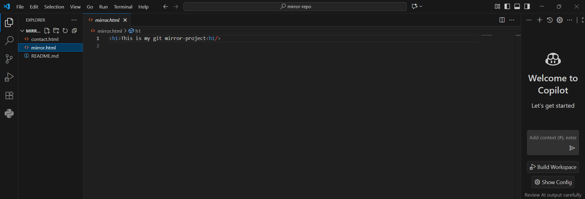
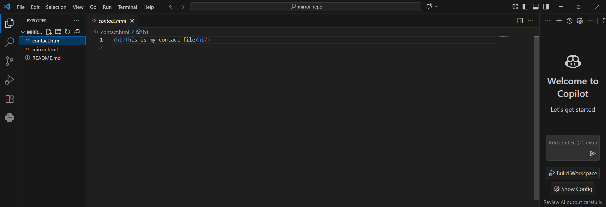
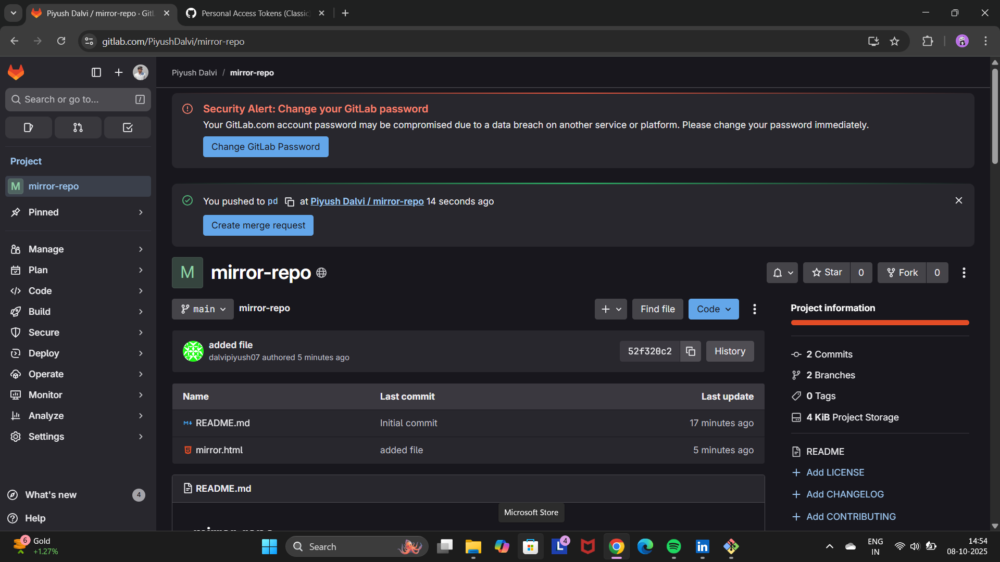
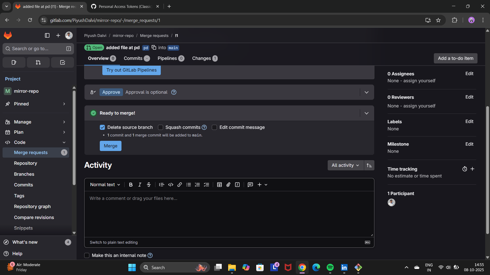
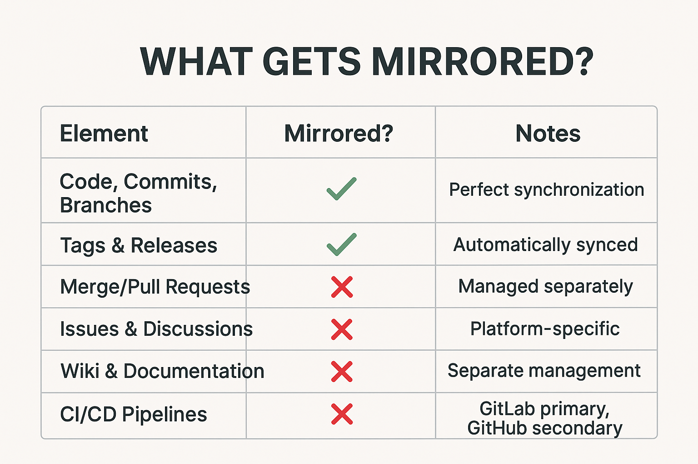

# Project Mirroring: GitLab ↔ GitHub

**This repository is mirrored between GitLab and GitHub. This means that commits, branches, and tags pushed to one platform are automatically synchronized to the other.**

##  Overview

This project demonstrates seamless synchronization between GitLab and GitHub using **Push Mirroring**. The setup ensures that all code changes, branches, and merge requests are automatically reflected across both platforms, providing redundancy and leveraging the strengths of both ecosystems.


###  How It Works

We use GitLab's Push Mirroring feature to automatically keep the GitHub repository in sync.

**Primary (Upstream) Repository:** `https://gitlab.com/PiyushDalvi/mirror-repo.git`

**Mirror (Downstream) Repository:** `https://github.com/dalvipiyush07/mirror-repo-github.git`

All development and primary CI/CD pipelines typically run on the GitLab repository. When code is pushed to GitLab, it is automatically mirrored to GitHub.

####  Step-by-Step Implementation Guide

### 1.Create create repositories in `GITTHUB and GITLAB`
## Github Repo


## Gitlab Repo


### 2.Add Username and Password in mirror setting.

**1.Give Username of your Github :-**`dalvipiyush07`

**2.Give token as Password :-** `asdfghj12345678`


### 3.Clone Repo

**1.Clone your `gitlab` repo in your `client side machine`

```bash
git $ git clone https://gitlab.com/PiyushDalvi/mirror-repo.git
```
### 4.Create File

**1.In your editor create html file like`mirror.html`**


**2.Add,Commit and Push**
```bash

git add .
git commit -m "file added"
git push -u origin main
```
### 5.Add New Branch

**After these steps the html file is uploaded successfully add new branch name as `pd `and file name as `contact.html`.**





**Add and Commit**
```bash
 git checkout -b pd
 nano contact.html
 git add .
 git commit -m "added file at pd"
 git push -u origin pd
```
### 6.MR (Merge Request)

**After creating new branch and push user will get notify in gitlab.**



**Click on `create merge request`**

### 7.Create Merge Request

**Create Merge Request and Give permmision**


**After doing this step you will see your file is merged**



### 8. Verify Synchronization
**Check both repositories to confirm the merge is reflected:**

### Github


### Gitlab


##  What is Mirrored?



##  Contribution Guidelines

**✅ DO:**

1.Push code to the GitLab repository

2.Create Merge Requests on GitLab

3.Use feature branches for new development

4.Follow the established branching strategy

**❌ DO NOT:**
1.Push directly to the GitHub repository (it's read-only mirror)

2.Create Pull Requests on GitHub (use GitLab Merge Requests)

3.Force push to either repository

###  Future Ready:
This mirroring strategy provides a scalable foundation for collaborative development, combining the strengths of both platforms while maintaining clean version control practices. The implementation proves that teams can effectively utilize multiple git hosting services without compromising on workflow efficiency or code integrity.

The mirroring setup delivers the best of both worlds - GitLab's robust DevOps capabilities and GitHub's extensive ecosystem - creating an ideal environment for modern software development. 